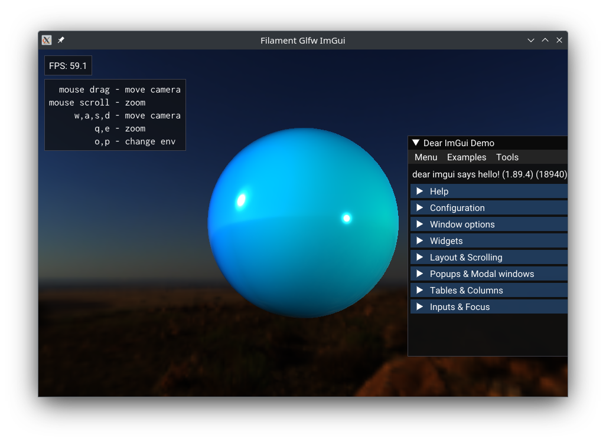

This is a header-only library and sample code for using Filament with GLFW and ImGui.



### Building and Running
```
git clone https://github.com/google/filament.git && \
  (cd filament && git checkout tags/v1.32.1)
git clone https://github.com/glfw/glfw.git && \
  (cd glfw && git checkout tags/3.3.8)
git clone https://github.com/ambrusc/filament-glfw-imgui.git && \
  cd filament-glfw-imgui && \
  ./build.sh deps && \
  ./build.sh resources && \
  ./build.sh demo && \
    (cd build && ./demo)
```

### Tested Platforms
- MacOS, x86-64, Filament backend Metal
- Linux: Manjaro, x86-64, Filament backend OpenGL and Vulkan, X11

### Principles
The code strives to be concise and readable (reading the code, including build.sh is encouraged). 

Everything in __filament_glfw_imgui__ strives to be as modular as possible. It's header-only, and use should be able to pick and choose which parts work well in your app. In addition, we try to expose a fairly granular set of APIs. If the easy-mode "App" doesn't work for you, you can of course modify it, or just use its consituent components any way you'd like.

### Folder Structure
- __3p__: "third party" stuff
- __build__: the output folder for builds
- __filament_native__: thin platform-specific library to help initialze the native window for Filament
- __filament_glfw_imgui__: main header-only library for this repo
- __demo__: a working sample app (take the fs_* files with a grain of salt; they probably don't follow Filament best practices.)

### Rationale
- Why make this library, and not just use FilamentApp, etc?
  - They're not intended for production use, and not considered part of the supported library.
    - [#6154](https://github.com/google/filament/issues/6154) "These are not libraries we wish to support as public APIs. Maybe filagui but definitely not filament app. At least not in its current form."
- Why not SDL like the filament samples?
  - I couldn't get it to run on Linux without horrendous screen tearing that would appear after a few minutes of seemingly vsync'd rendering. It seemed to be platform-specific, and would cause Plasma desktop to flicker, corrupting windows of other apps. It was probably user error on my part, but I eventually gave up.
  - [#5242](https://github.com/google/filament/issues/5242) I'm not the only one with issues on linux.
  - GLFW also claims to be [lighter weight than SDL](https://www.glfw.org/faq.html#13---why-yet-another-opengl-library) and I've had good luck with it in the past.
- But [such-and-such] already did this. Why not use theirs?
  - Here are some [alternatives](#-alternatives) I found, which may be useful to you. If you know of any more, I'm open to linking those as well.
- Because it was a challenge and I felt like doing it :-)

### Known (or Suspected) Issues
- Vsync is not well supported in Filament
  - But if Vsync is enabled, Filament seems to let you know when a frame is already rendered (or currently rendering) for the next screen refresh.
  - The app/code doesn't seem to have access to enabling or disabling vsync - it can be toggled in your video driver though.
  - [#6675](https://github.com/google/filament/issues/6675): "The sample schedules frames badly using a fixed timestep of ~16ms, it doesn't try to use vsync at all."
  - [#4337](https://github.com/google/filament/issues/4337): You can force Vsync on/off in your video driver.
  - [#636](https://github.com/google/filament/issues/636): Claims that Vsync callbacks were added but newer issues (above) seem to indicate otherwise.
- Few platforms tested: see [Tested Platforms](#-tested-platforms) above
- I haven't tested Wayland and it probably would require a new implementation of `filament_native_...cpp`.
- filament_imgui only supports 65535 vertices total. This is fixable, I just haven't done it yet.

### Alternatives
- [prideout/glfw_filament.cpp](https://gist.github.com/prideout/7b9697a984d676516d59c05ef42fbd0c)
- [roxlu/filament-with-glfw](https://github.com/roxlu/filament-with-glfw)
